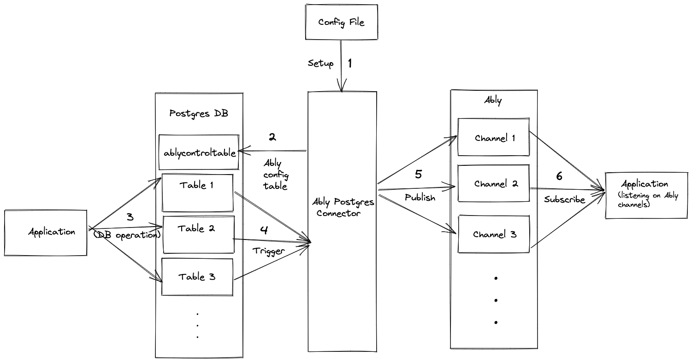
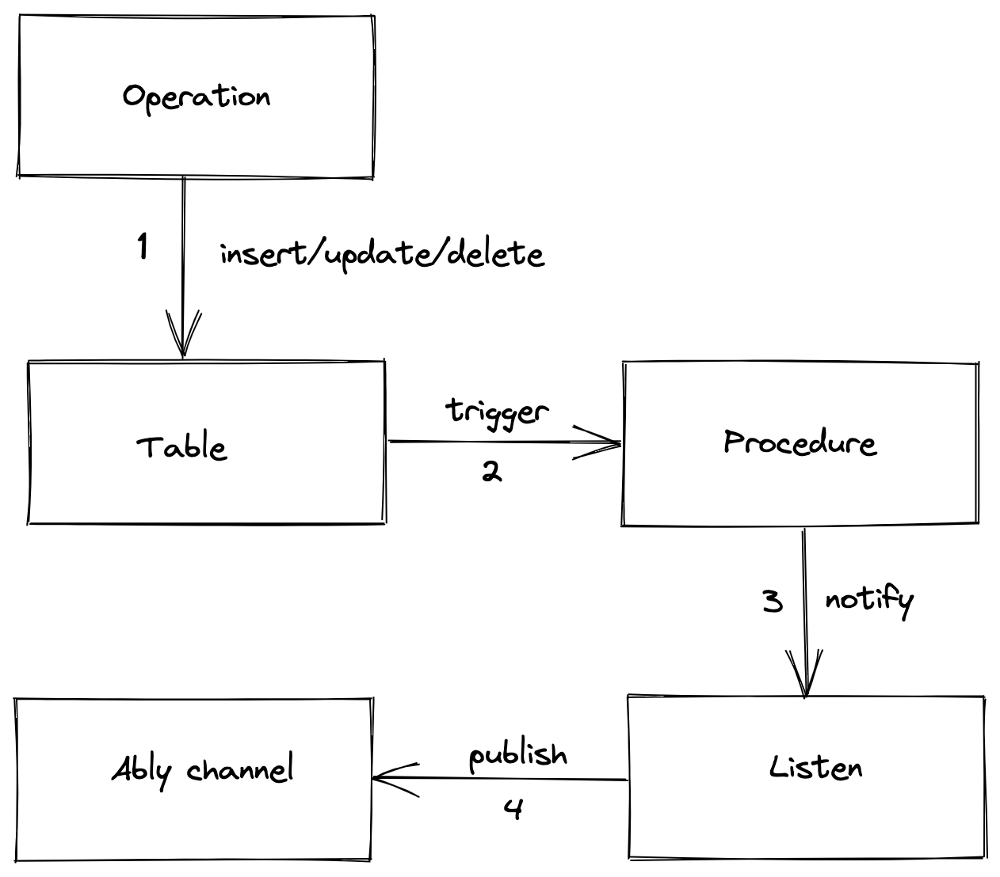

## Streaming PostgresDB changes to millions of clients in realtime

The Ably-Postgres connector publishes a message on a given Ably channel whenever any operations (insert/update/delete) are executed on the tables of your PostgreSQL database.

You can setup the connector with the configuration details of your database, as well as the Ably app, including your API Key, channel names for various types of updates, etc.

Check out the [example config](config/default.json) for more info.

### Prerequisites

- PostgreSQL (tested on version 13)
- Ably account

### Installation

```sh
    npm install ably --save
```

### Example usage

```javascript
    // test-lib.js
    const { postgresconnector } = require("ably-postgres-connector");
    const test_lib = () => {
    postgresconnector("config/default.json");
    };

    test_lib();
```

### Running

```sh
    node test-lib.js
```

### How to run it locally

Open the `config/default.json` file and add your database and Ably account credentials as needed.

- If you don't already have a table, create one in your DB. For example, for a table named `users`:

```sql
    CREATE TABLE users (
        id integer,
        name text
    );
```

- Update the database & Ably credentials in the `config/default.json` file. (You can skip this step if you are using `docker-compose`)

- Option 1 - Run the test file using the commands below:

  ```
  npm i
  node test.js
  ```

- Option 2 - Run the full library

  ```
  cd ts-proj
  npm i
  npm run build
  cd ..
  node test-lib.js
  ```

- Option 3 - Running through `docker-compose`

  ```
  docker-compose run connector
  ```

- Visit your Ably dev console and connect to the channel `ablyusersins` (or whichever channel you specified in your config). Try performing various operations (insert, update, delete) on your table. For every change, you should see a new message in the specific channel(s).

- The JS version (option 1) is for running it quickly from source & testing. You can't provide the config path in that, it by default uses the `config/default.json`.

- The TS version (option 2) is to build the library from source (which is published on npm) and allows you to provide custom config path.

- The docker-compose option uses the TS version to create the docker image and takes care of setting up the Postgres DB as well. This option basically provides an example to how you can integrate this through Docker with your application.

### How does it work?



- The config file contains the details related to the tables you want to listen for data changes on and your Ably API key.
- Using that config file, the connector creates a Ably config table `ablycontroltable` to maintain the table to Ably channel mapping in the DB.



- The connector then creates a DB procedure/function which basically performs the [`pg_notify`](https://www.postgresql.org/docs/current/sql-notify.html) function that publishes data changes on a data channel.
- The connector then creates triggers for the table-operation combination specified in the config. The job of the trigger is to execute the procedure created above.
- The connector is listening for changes on that particular data channel using the [`LISTEN`](https://www.postgresql.org/docs/current/sql-listen.html) feature. When it gets a notification it publishes the data on the appropriate Ably channel.
