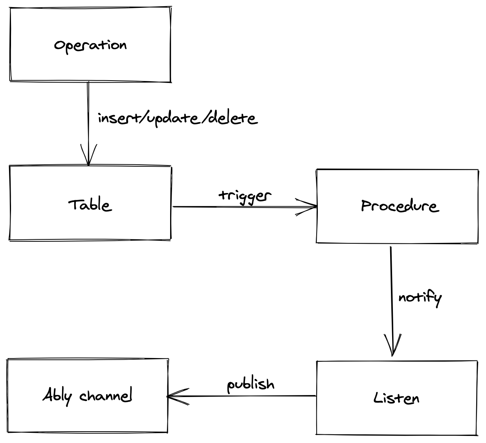

## Streaming PostgresDB changes to millions of clients in realtime

The Ably-Postgres connector publishes a message on a given Ably channel whenever any operations (insert/update/delete) are executed on the tables of your PostgreSQL database.

You can setup the connector with the configuration details of your database, as well as the Ably app, including your API Key, channel names for various types of updates, etc.

Check out the [example config](config/default.json) for more info.

### Prerequisites

- PostgreSQL (tested on  version 13)
- Ably account

### How to run it locally

Open the `config/default.json` file and add your database and Ably account credentials as needed.

- If you don't already have a table, create one in your DB. For example, for a table named `users`:

```sql
CREATE TABLE users (
    id integer,
    name text
);
```

- Update the database & Ably credentials in the `config/default.json` file. (You can skip this step if you are using `docker-compose`)

- Option 1 - Run the test file using the commands below:

    ```
    npm i
    node test.js
    ```

- Option 2 - Run the full library
    ```
    cd ts-proj
    npm i
    npm run build
    cd ..
    node test-lib.js
    ```

- Option 3 - Running through `docker-compose`
    ```
    docker-compose run connector
    ```

- Visit your Ably dev console and connect to the channel `ablyusersins` (or whichever channel you specified in your config). Try performing various operations (insert, update, delete) on your table. For every change, you should see a new message in the specific channel(s).



### How does it work?